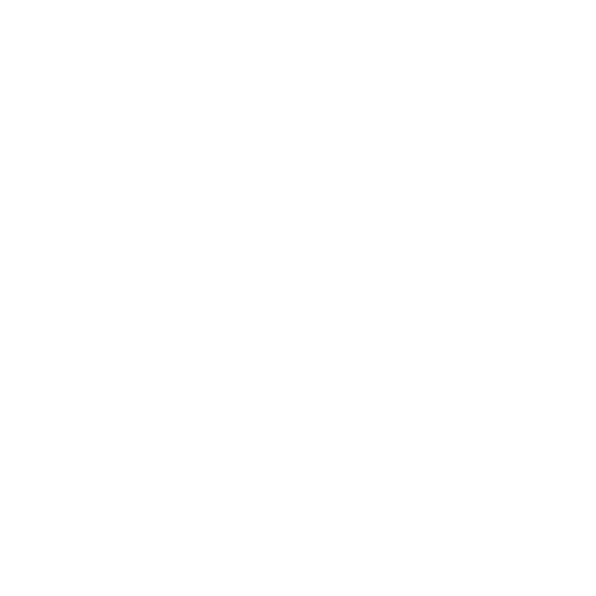

# sit-to-fit

  
 

 
## **BACKEND Repository for Sit-to-fit Website Product.**
## About the project
The product is designed for the working class adults in the age group of 18 to 24 years who have a Sedentary Lifestyle due to excessive desk jobs. The Sedentary Behaviour has been coined by WHO as **Sitting is the new Smoking**. The product takes the user on an interactive journey to learn about the long lasting repercussions of this lifestyle and provides intuitive and fun acitivities around Melbourne CBD to break the sedentary behaviour and engage in fun activities.
## Projects
The repository holds the Source code for our Interactive features that we have added to our website. 
1. Risk Meter Analysis
2. Recommendation System
## Built With
* [![Python][Python 3.9.7]][Python-url]
* [![R-Studio][RStudio]][Rstudio-url]
* [![R][R]][R-url]
* [![Flask][Flask]][Flask-url]
* [![Heroku][Heroku]][Heroku-url]
## Front-End
Check out our **Front-End repository** at https://github.com/z-sx/sit-to-fit
## Product
Check out our website at https://sittofit.tk/
## Created and Maintained By:
Ounam Gupta - 31176097
## Contact

Ounam Gupta - [@linkedin_handle](https://www.linkedin.com/in/ounamg008/) - ogup0002@student.monash.edu

[Python-url]: https://www.python.org/
[Rstudio-url]: https://shiny.rstudio.com/
[R-url]: https://www.r-project.org/
[Flask-url]: https://flask.palletsprojects.com/en/2.2.x/
[Heroku-url]: https://id.heroku.com/login
